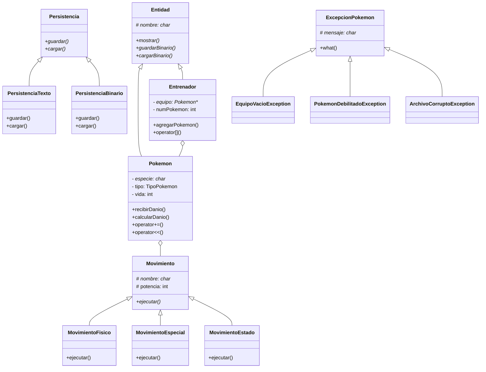

# Entrega 4 — POO Estructura y Diseño

## 🎯 Objetivo

Refactorizar **todo el código** de las entregas anteriores aplicando principios avanzados de POO, herencia, polimorfismo, sobrecarga de operadores, excepciones, y buenas prácticas de diseño. **La funcionalidad visible para el usuario se amplía: ahora hay movimientos con nombres reales, tipos de ataque, y efectos especiales.**

Este es el **refactor final** que demuestra que sabéis estructurar código profesionalmente.

---

## 🎮 Experiencia de usuario — ¿Qué cambia para el jugador?

El usuario percibe los siguientes cambios visibles respecto a E3:

### 1. Ataques con nombres reales

En E3 solo existía "Atacar". En E4 cada Pokémon tiene 4 movimientos reales:

```
[Turno de Ash - TÚ DECIDES]
Pika (Pikachu) - ❤️ 110/110   |   Rocky (Geodude) - ❤️ 120/120

Elige movimiento:
1. Impactrueno (Eléctrico) - 40 de potencia
2. Placaje (Normal) - 35 de potencia
3. Ataque Rápido (Normal) - 30 de potencia (golpea primero)
4. Gruñido (Normal) - Reduce defensa del rival
> 1

Pika usa Impactrueno!
Es súper efectivo! ⚡
Geodude recibe 68 de daño!
```

### 2. Tipos de movimiento con efectos distintos

| Tipo de movimiento | Ejemplo | Efecto |
|-------------------|---------|--------|
| `MovimientoFisico` | Placaje, Lanzarrocas | Usa ataque físico del Pokémon |
| `MovimientoEspecial` | Impactrueno, Llamarada | Usa ataque especial, ignora defensa parcialmente |
| `MovimientoEstado` | Gruñido, Malicioso | No hace daño, aplica efecto (bajar defensa, paralizar, etc.) |

### 3. Clasificación visual en la batalla

La batalla ahora es más vistosa y muestra el tipo de movimiento:

```
Pika usa Impactrueno!  (⚡ ESPECIAL)
Daño: 68 - CRÍTICO!

----------

Rocky usa Lanzarrocas!  (🏔️ FÍSICO)
Daño: 22
```

### 4. Excepciones visibles al usuario

Cuando algo va mal, el usuario ve mensajes de error descriptivos:

```
¡No puedes usar a Pika! Está debilitado.
(PokemonDebilitadoException)

¡El equipo de Brock está vacío! Batalla cancelada.
(EquipoVacioException)

Error: El archivo partida.bin está corrupto (checksum inválido)
(ArchivoCorruptoException)
```

### 5. Nuevos operadores que afectan al gameplay

```cpp
Pokemon p1("Pika", "Pikachu", "Electrico", 25, 110, 55, 40, 90);
p1 += 30;   // Curar 30 PS (usando operator+=)
p1 -= 45;   // Recibir 45 de daño (usando operator-=)

Entrenador ash("Ash");
ash += p1;  // Añadir pokémon al equipo (usando operator+=)

Pokemon* p = ash[0];  // Acceder al primer pokémon (usando operator[])
cout << ash;          // Mostrar entrenador completo (usando operator<<)

// Incluso batalla con operador -
Batalla resultado = ash - brock;  // operator- que ejecuta batalla automática
```

### 6. Factory de Pokémon

El usuario puede crear Pokémon desde un menú:

```
--- CREAR POKÉMON ---
1. Crear por nombre (Pikachu, Charmander...)
2. Crear aleatorio
3. Crear desde archivo
> 1

Nombre: Pikachu
Nivel: 50
¡Pikachu creado con Placaje, Impactrueno, Ataque Rápido, Gruñido!

--- MOVIMIENTOS ASIGNADOS ---
1. Impactrueno (Eléctrico, Especial, 40)
2. Placaje (Normal, Físico, 35)
3. Ataque Rápido (Normal, Físico, 30)
4. Gruñido (Normal, Estado, --)
```

### 7. Namespaces visibles en mensajes de error

```
[PokemonGame::Core::Batalla] ¡Ash gana la batalla!
[PokemonGame::IO::PersistenciaBinario] Partida guardada en partida.bin
```

---

### Resumen visual: ¿Qué VE el usuario en cada entrega?

| Aspecto | E1 | E2 | E3 | E4 |
|---------|----|----|----|----|
| Batalla | "Atacar" | "Atacar" | "Atacar" + sprites | Impactrueno, Placaje... |
| Personalización | ❌ | Edita TXT | Edita TXT | Factory + TXT |
| Persistencia | ❌ | Equipos (config) | Partida (estado) | Todo |
| Sprites | ❌ | ❌ | ✅ | ✅ |
| Mensajes error | if/else básico | if/else | if/else | Excepciones con nombre |
| Operadores | ❌ | ❌ | ❌ | `+=`, `-=`, `[]`, `<<`, `>>`, `-` |
| Estructura código | Clases planas | Clases planas | Clases planas | Herencia + polimorfismo |

---

## 📋 Especificaciones

### 1. Jerarquía de clases (herencia y polimorfismo)

**`class Entidad`** (abstracta)
```cpp
class Entidad {
protected:
    char* nombre;
public:
    Entidad(const char* nombre);
    virtual ~Entidad();
    virtual void mostrar() const = 0;
    virtual void guardarBinario(ofstream& archivo) const = 0;
    virtual void cargarBinario(ifstream& archivo) = 0;
    const char* getNombre() const;
    void setNombre(const char* nombre);
};
```

**`class Pokemon : public Entidad`**
```cpp
class Pokemon : public Entidad {
private:
    char* especie;
    TipoPokemon tipo;
    int vida, vidaMax, ataque, defensa, velocidad, nivel;
public:
    // Constructor, destructor, copia, operator=
    void mostrar() const override;            // Añade stats específicos
    void guardarBinario(ofstream&) const override;
    void cargarBinario(ifstream&) override;
    // Métodos propios
    void recibirDanio(int dmg);
    void curar();
    bool estaVivo() const;
    int calcularDanio(const Pokemon& defensor) const;
    // Sobrecarga de operadores
    Pokemon& operator+=(int curacion);         // Curar
    Pokemon& operator-=(int danio);            // Recibir daño
    bool operator==(const Pokemon& otro) const; // Comparar por especie+nivel
    friend ostream& operator<<(ostream& os, const Pokemon& p);
    friend istream& operator>>(istream& is, Pokemon& p);
};
```

**`class Entrenador : public Entidad`**
```cpp
class Entrenador : public Entidad {
private:
    Pokemon** equipo;
    int numPokemon;
    int capacidad;
    void redimensionar(int nuevaCapacidad);
public:
    void mostrar() const override;
    void guardarBinario(ofstream&) const override;
    void cargarBinario(ifstream&) override;
    void agregarPokemon(const Pokemon& p);
    bool eliminarPokemon(int indice);
    Pokemon* getPokemon(int indice) const;
    int getNumPokemon() const;
    // Sobrecarga de operadores
    Pokemon* operator[](int indice) const;     // Acceder a pokémon
    Entrenador& operator+=(const Pokemon& p);  // Añadir pokémon
    friend ostream& operator<<(ostream& os, const Entrenador& e);
};
```

### 2. Interfaz de persistencia (polimorfismo)

**`class Persistencia`** (interfaz pura)
```cpp
class Persistencia {
public:
    virtual ~Persistencia() {}
    virtual void guardar(const Entrenador& e, const char* filename) = 0;
    virtual Entrenador* cargar(const char* filename) = 0;
    virtual const char* tipo() const = 0;  // "texto" o "binario"
};
```

**`class PersistenciaTexto : public Persistencia`** (refactor de E2)
**`class PersistenciaBinario : public Persistencia`** (refactor de E3)

Uso polimórfico:
```cpp
Persistencia* pers = nullptr;
if (formato == "texto")
    pers = new PersistenciaTexto();
else
    pers = new PersistenciaBinario();
pers->guardar(entrenador, "datos");
delete pers;
```

### 3. Jerarquía de movimientos

**`class Movimiento`** (abstracta)
```cpp
class Movimiento {
protected:
    char* nombre;
    TipoPokemon tipo;
    int potencia;
public:
    virtual void ejecutar(Pokemon& atacante, Pokemon& defensor) = 0;
    virtual void mostrar() const = 0;
    virtual ~Movimiento();
};
```

**`class MovimientoFisico : public Movimiento`** — usa ataque físico del Pokémon
**`class MovimientoEspecial : public Movimiento`** — usa ataque especial
**`class MovimientoEstado : public Movimiento`** — aplica efectos (dormir, paralizar, etc.)

Cada Pokémon tendrá un array dinámico de `Movimiento*` (punteros polimórficos).

### 4. Excepciones personalizadas

```cpp
class ExcepcionPokemon {
protected:
    char* mensaje;
public:
    ExcepcionPokemon(const char* msg);
    virtual const char* what() const;
    virtual ~ExcepcionPokemon();
};

class EquipoVacioException : public ExcepcionPokemon { ... };
class PokemonDebilitadoException : public ExcepcionPokemon { ... };
class MochilaVaciaException : public ExcepcionPokemon { ... };
class ArchivoCorruptoException : public ExcepcionPokemon { ... };
```

Uso obligatorio en:
- Intentar usar un Pokémon debilitado en batalla
- Intentar pelear con equipo vacío
- Cargar archivo corrupto

### 5. Namespaces

```cpp
namespace PokemonGame {
    namespace Core {
        class Pokemon;
        class Entrenador;
        class Mochila;
        class Batalla;
    }
    namespace IO {
        class Persistencia;
        class PersistenciaTexto;
        class PersistenciaBinario;
        class UI;
    }
    namespace Exceptions {
        class ExcepcionPokemon;
        // ...
    }
}
```

### 6. Factory Method para creación de Pokémon

```cpp
class PokemonFactory {
public:
    static Pokemon* crearPorNombre(const char* nombre);
    static Pokemon* crearAleatorio(int nivel);
    static Pokemon* desdeArchivo(const char* filename);
};
```

### 7. Sobrecarga de operadores (adicionales)

- `<<` para imprimir cualquier clase del dominio
- `>>` para leer desde consola/archivo
- `-` para batalla simulada (`Batalla resultado = entrenador1 - entrenador2;`)
- `++` para subir de nivel a un Pokémon

### 8. Estructura de archivos refactorizada

```
include/
  Core/
    Entidad.h
    Pokemon.h
    Entrenador.h
    Mochila.h
    Batalla.h
    Movimiento.h
    MovimientoFisico.h
    MovimientoEspecial.h
    MovimientoEstado.h
  IO/
    Persistencia.h
    PersistenciaTexto.h
    PersistenciaBinario.h
    UI.h
  Exceptions/
    ExcepcionPokemon.h
  Factory/
    PokemonFactory.h
  Tipos.h
src/
  Core/
    Pokemon.cpp
    Entrenador.cpp
    Mochila.cpp
    Batalla.cpp
    Movimiento.cpp
    MovimientoFisico.cpp
    MovimientoEspecial.cpp
    MovimientoEstado.cpp
  IO/
    PersistenciaTexto.cpp
    PersistenciaBinario.cpp
    UI.cpp
  Exceptions/
    ExcepcionPokemon.cpp
  Factory/
    PokemonFactory.cpp
  main.cpp
data/
  pokemon.txt
  equipo.txt
  partida.bin
  sprites/
    Pikachu.spr
    Charmander.spr
    Squirtle.spr
Makefile
```

---

## 🔄 Cambios vs E3

| Aspecto | E3 | E4 |
|---------|----|----|
| Código original | Procedural mezclado con clases | POO puro con herencia |
| Movimientos | Hardcodeados o tabla | Jerarquía polimórfica |
| Persistencia | Clases independientes con static | Interfaz polimórfica común |
| Errores | if/else | Excepciones personalizadas |
| Operadores | No usados | Sobrecarga (<<, >>, +=, -=, [], -) |
| Namespaces | No | PokémonGame::Core, IO, Exceptions |
| Creación Pokémon | Manual | Factory Method |
| Archivos | 6-8 archivos planos | 20+ archivos organizados en carpetas |

**Importante:** la funcionalidad visible para el usuario debe ser la misma. Los tests de caja negra de E1-E3 deben pasar igual.

---

## ✅ Criterios de evaluación

| Criterio | Peso |
|----------|------|
| Herencia y polimorfismo correctos (Entidad, Persistencia, Movimiento) | 20% |
| Sobrecarga de operadores (mín. 4 operadores distintos) | 15% |
| Excepciones personalizadas (mín. 3 tipos distintos) | 15% |
| Namespaces correctamente usados | 10% |
| Factory Method implementado | 10% |
| La funcionalidad de E1-E3 se mantiene intacta | 10% |
| Estructura modular (carpetas, includes, Makefile) | 10% |
| Calidad del código (DRY, nombres, const-correctness) | 10% |

---

## 🚀 Compilación

```bash
make entrega4
./programa
```

---

## 📤 Entrega

- Subir a GitHub en carpeta `Entrega4/`
- El `Makefile` debe permitir compilar con `make`
- La estructura de carpetas debe reflejar la especificada
- Incluir un `DIAGRAMA.md` con el diagrama UML de clases (en texto o Mermaid)
- Incluir `README.md` explicando el diseño

---

## 📊 Diagrama UML (Mermaid)


